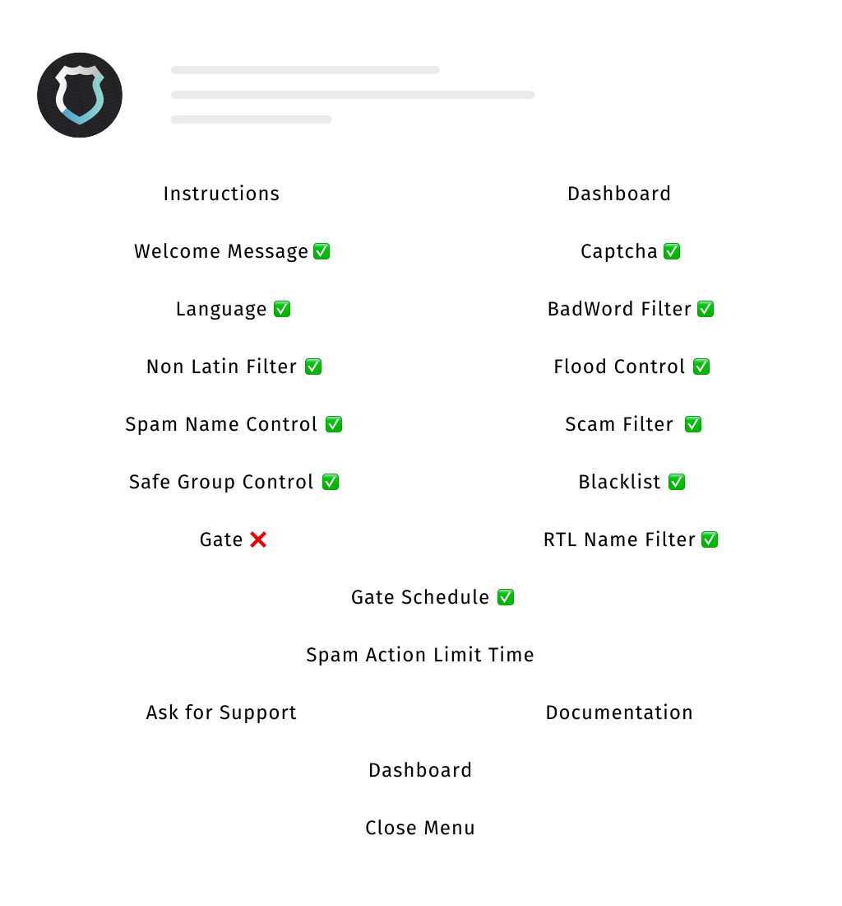

Type `/config` to enter all the **bot settings**. The bot will return an interactive control keyboard GUI as shown below.

In this menu you can activate or deactivate the bot features just by clicking on the respective button:
- if the feature is activated it will show "✅" next to the function name
- if the feature is disabled it will show "❌" next to the function name

## Buttons

Here the list of the buttons available in this menu:
- [Instructions](unifiedban.solutions) (it will just link you the official site of the bot)
- [Dashboard](/docs/dashboard)
- [Welcome Message](/docs/welcome)
- [Captcha](/docs/captcha)
- [Language](/docs/language)
- [BadWord Filter](/docs/badwords)
- [Non Latin Filter](/docs/nonlatin)
- [Flood Control](/docs/flood)
- [Spam Name Control](/docs/spamname)
- [Scam Filter](/docs/scamfilter)
- [Safe Group Control](/docs/safegroups)
- [Blacklist](/docs/blacklist)
- [Gate](/docs/gate)
- [RTL Name Filter](/docs/rtlnames)
- [Gate Schedule](/docs/gateschedule)
- [Spam Action Limit Time](/docs/salt)
- [Ask for Support](/docs/support)

